# Smart Helpdesk with Agentic Triage

A full-stack helpdesk / ticketing system which includes agentic triage to assist agents in ticket classification, knowledge base (KB) retrieval, draft suggestions, and user/agent dashboards.  

---

## 🎯 Features

- **User roles**: User, Agent, Admin  
- **Authentication**: Signup / Login using JWT  
- **User functionalities**:  
  - Create tickets (subject + body)  
  - View own tickets and replies  
  - Track ticket status  

- **Agent/Admin functionalities**:  
  - View all tickets  
  - Reply to tickets  
  - Update status (open, in_progress, waiting_human, resolved)  
  - Knowledge Base articles (create, edit, delete)  
  - Dashboard with search and filter  

- **Agentic Triage Workflow**:  
  - Classification of tickets into categories  
  - Retrieval of related KB articles  
  - Draft reply suggestions  

- **UI / UX**: Responsive design; form validation; loading spinners; clean and modern look  

---

## 📸 Demo Screenshots  

Here are some visual walk-throughs of your system:

| Description | Screenshot |
|-------------|------------|
| **Signup Page** | 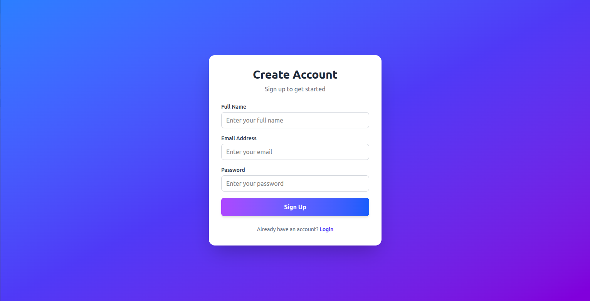 |
| **Login Page** | 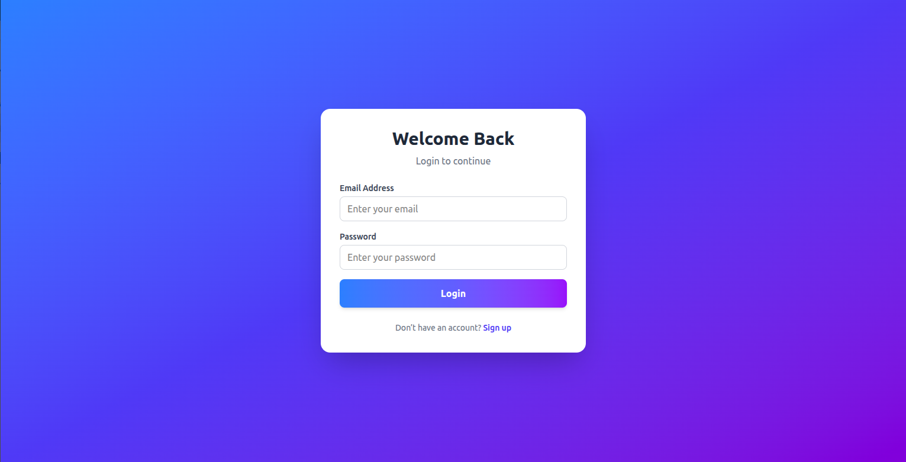 |
| **User Dashboard / Create Ticket** |  |
| **User Dashboard / View Tickets** | 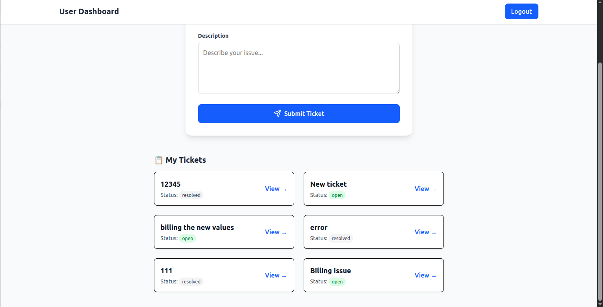 |
| **User Dashboard / Tickets Detail** | 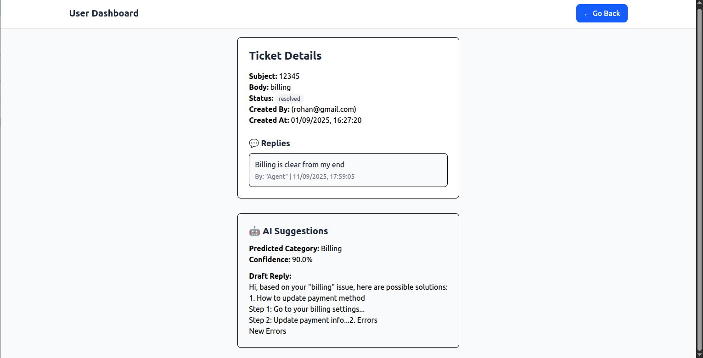 |
| **Admin Dashboard / Ticket List** | 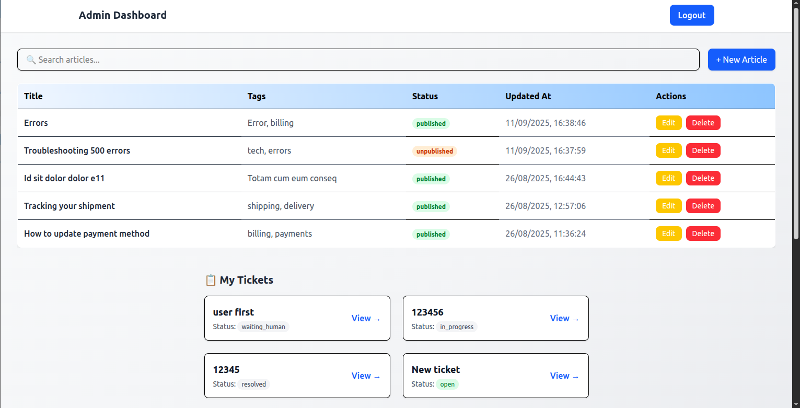 |
| **Admin Dashboard / Ticket Details** | 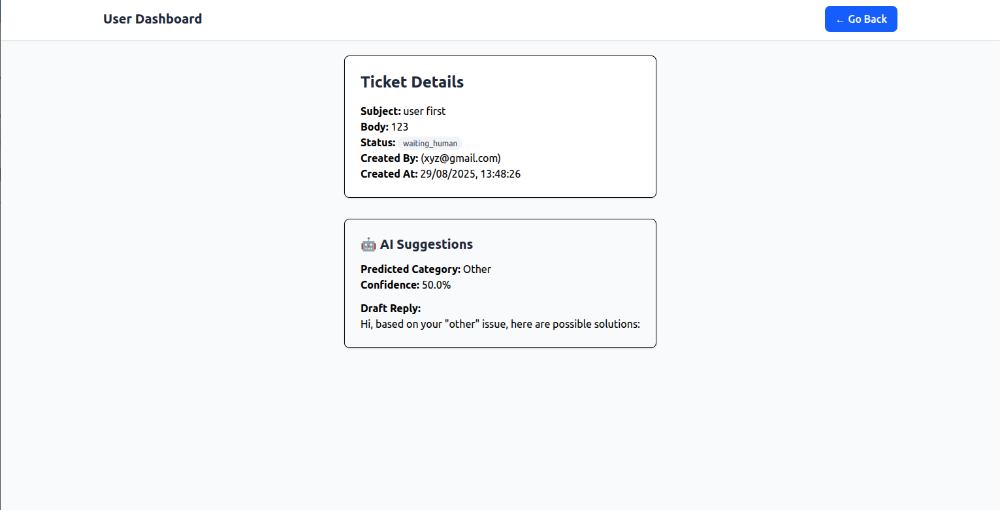 |
| **Admin Dashboard / Search List** | 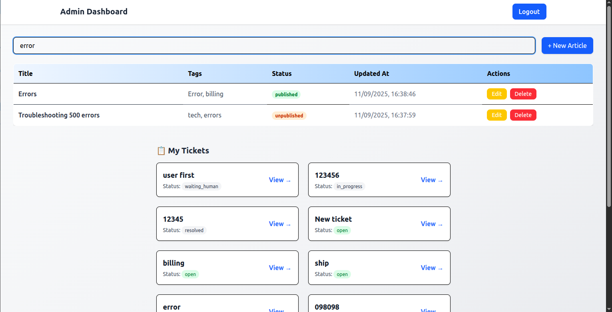 |
| **Admin Dashboard / Edit ticket List** | 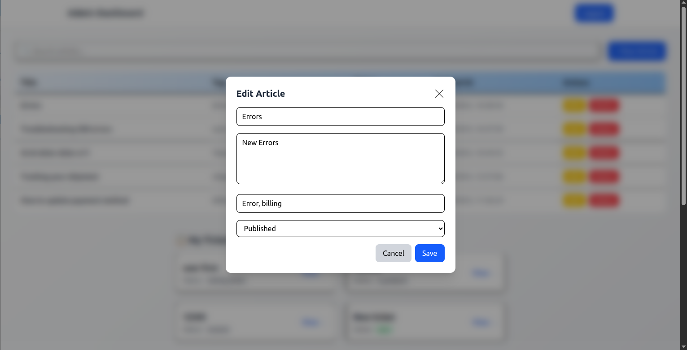 |
| **Admin Dashboard / create ticket List** | 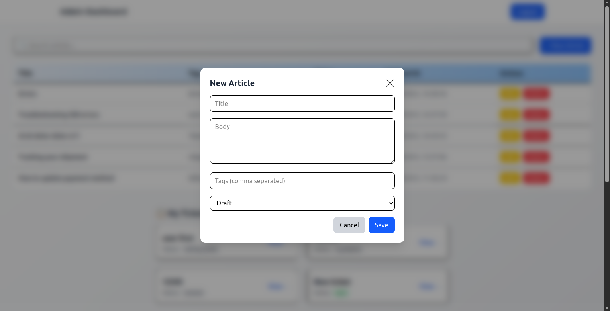 |
| **Agent Dashboard / Ticket List** | 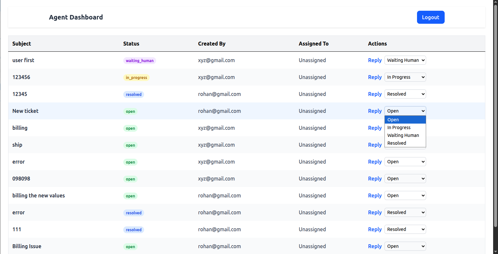 |
| **Redirect Spinner** | 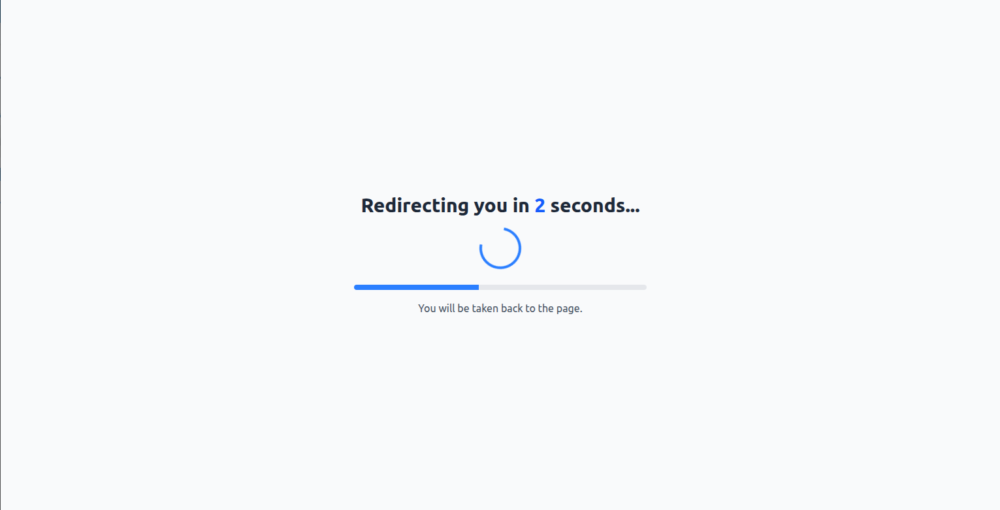 |

---

## 🏗️ Tech Stack

| Frontend | Backend | Other Tools |
|----------|---------|-------------|
| React (Vite or CRA) | Node.js + Express | MongoDB + Mongoose |
| TailwindCSS + UI styling | JWT Authentication | Axios for API calls |
| Formik + Yup for forms & validation | Protected routes / middleware | React Router DOM |
| Responsive UI | REST APIs for tickets, KB, suggestions | React Context API for auth |

---

## 📂 Project Structure

Smart-Helpdesk-with-Agentic-Triage/

├── backend/

│ ├── controllers/

│ ├── middleware/

│ ├── models/

│ ├── routes/

│ └── server.js (or app.js)

├── frontend/

│ ├── src/

│ │ ├── components/

│ │ ├── context/

│ │ ├── pages/

│ │ ├── config.js

│ │ └── App.jsx / main entry

│ └── public/ or assets/

├── screenshots/

│ └── *.png / *.gif

├── README.md

└── .gitignore

yaml
Copy code

---

## 🛠️ Setup Instructions

### 1. Clone the Repo  
```bash
git clone https://github.com/Vaibhavduudhabhate/Smart-Helpdesk-with-Agentic-Triage.git
cd Smart-Helpdesk-with-Agentic-Triage
2. Backend Setup
bash
Copy code
cd backend
npm install
Copy .env.example or create .env with:

env
Copy code
MONGO_URI=<your MongoDB connection string>
JWT_SECRET=<some secret key>
PORT=5000   # or your preferred port
Start server:

bash
Copy code
npm start
3. Frontend Setup
bash
Copy code
cd frontend
npm install
In frontend/src/config.js or similar, set API_URL, e.g.:

js
Copy code
export const API_URL = "http://localhost:5000/api";
Start frontend:

bash
Copy code
npm run dev       # if using Vite
# or
npm start         # if CRA
🔑 Usage Flow
Signup / Login
Create an account (User or Agent/Admin).

User Dashboard

Create tickets

View tickets & replies

Agent Dashboard

See all tickets

Use suggestions to draft replies

Reply & change status

Admin Dashboard

Manage KB articles

See all tickets

Redirect Spinner
After certain actions you’ll see a spinner redirect (for example, after logout or unauthorized access).

✅ Environment & Config
Make sure you have:

A running MongoDB instance

.env settings correct with MONGO_URI and JWT_SECRET

API URL in frontend matches backend (CORS allowed if on different ports)

Proper roles assigned to users (User, Agent, Admin)
